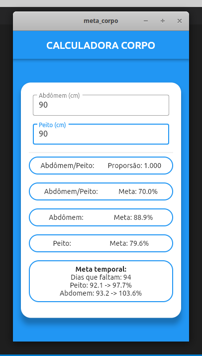

# meta_corpo

Esse app tem o objetivo de calcular a proporsão ideal de abdômem e peitoral, o ideal é ser de 0,70.

Tambem fiz calculo pra apresentar  qual medida ideal que devo alçancar diariamente até dia 31/12/20, pra atingir 80% da minha meta, está descria como *meta temporal*.

### Detalhes técnicos
- Foi desvolvido em Flutter com Mobx (Flutter 1.23.0-4.0.pre)
- Compilado pra Linux e Android

